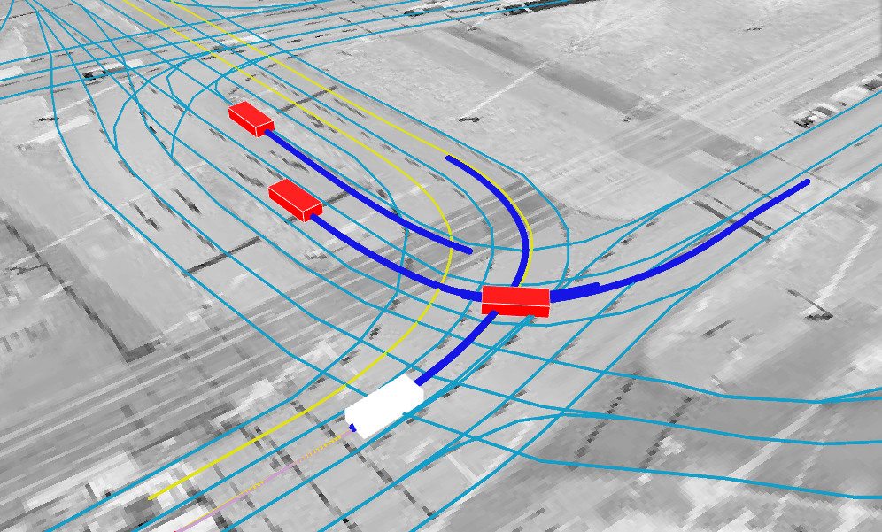
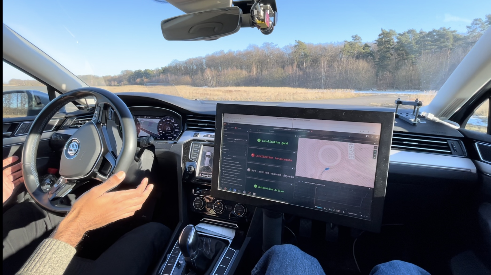

# Portfolio
This repository contains some of the projects I have worked on over the years. For some of them I can share the codebase.
For more information about me and the projects I worked on, please visit my [website](https://giovannilucente.github.io/portfolio/).

## 1. DeepGame-TP: Dynamic Game-Theoretic Trajectory Planner
The topic of this project is a trajectory planner based on a game-theoretical framework. Traffic is modeled as a non-cooperative dynamic game, in which agents choose their optimal strategies while considering that other agents are also optimizing their own strategies. The trajectory planner solves the dynamic game by computing the **Generalized Nash Equilibrium (GNE)**, a state where no agent can improve its outcome unilaterally, given the strategic choices and constraints of all other agents. For further information please check the [website of the project](https://github.com/giovannilucente/dynamic_game_trajectory_planner/index.html) and the related paper:

Giovanni Lucente, Mikkel Skov Maarssoe, Sanath Himasekhar Konthala, Anas Abulehia, Reza Dariani, Julian Schindler, **DeepGame-TP: Integrating Dynamic Game Theory and Deep Learning for Trajectory Planning**, *IEEE Open Journal of Intelligent Transportation Systems* (Volume: 5), 2024. DOI: [10.1109/OJITS.2024.3515270](https://ieeexplore.ieee.org/document/10793110).

For detailed information about the code, please refer to the [GitHub repository](https://github.com/giovannilucente/dynamic_game_trajectory_planner/).

  
  

## 2. Generative AI for Trajectory Prediction
This project is currently in progress.
This project focuses on training a model to predict vehicle trajectories. The model takes an input image representing the trajectory over the past second and generates an output image forecasting the trajectories for the next second within the traffic scenario.
For more details, visit the [project page](https://giovannilucente.github.io/portfolio/generative_ai_trajectory_prediction/index.html) and the [GitHub repository](https://github.com/giovannilucente/portfolio/tree/main/generative_ai_trajectory_prediction).
This project is conducted in collaboration with other colleagues from DLR.

  
  

Ground truth and predicted trajectories example.

## 3. Vehicle speed predictor based on LSTM-CNN hybrid neural network architecture
This project focuses on training a model that predicts vehicle speed using a LSTM-CNN hybrid network architecture. Follow the steps below to set up and run the training process. For more information visit the [project page](https://giovannilucente.github.io/LSTM_CNN_vehicle_speed_predictor/index.html) and the [GitHub repository](https://github.com/giovannilucente/LSTM_CNN_vehicle_speed_predictor). For further information please refer to the related paper:

Giovanni Lucente, Mikkel Skov Maarssoe, Iris Kahl, Julian Schindler, **Deep Learning Algorithms for Longitudinal Driving Behavior Prediction: A Comparative Analysis of Convolutional Neural Network and Long–Short-Term Memory Models**, *SAE International Journal of Connected and Automated Vehicles*, 2024. DOI: [10.4271/12-07-04-0025](https://doi.org/10.4271/12-07-04-0025).

## 4. Reinforcement Learning for Autonomous Driving
My Master's thesis completed at Politecnico di Milano under the supervision of Prof. Marcello Restelli. 
In this project, the topics of sensor noise and driving comfort in reinforcement learning are faced, providing a deep analysis on the robustness of the algorithm to noise and proposing a new solution for the comfort issue. The problem of comfort is faced with the proposal of a two step policy, a first step that is responsible for high level decisions, such as the time to enter in a cross, and a low level planner downstream. The planner receives as input the high level decisions and outputs the acceleration profile, optimizing the driving comfort. 
For further information please visit the [project website](https://giovannilucente.github.io/portfolio/reinforcement_learning_autonomous_driving/index.html) or read the full text [here](https://www.politesi.polimi.it/handle/10589/165482).

## 5. ADORe
Eclipse ADORe is a modular software library and toolkit for decision making, planning, control and simulation of automated vehicles. 
It is developed by the [German Aerospace Center (DLR), Institute for Transportation Systems](https://www.dlr.de/en/ts/). ADORe provides: 
- Algorithms and data models applied in real automated driving system for motion planning and control.
- Mechanisms for safe interaction with other CAVs, infrastructure, traffic management, interactions with human-driven vehicles, bicyclists, pedestrians
My contributions are:
- Development of decision-making, trajectory planning, and control systems.
- Development of multi-agent trajectory planning for infrastructure-managed traffic.
- Implementation of AI modules for intelligent recognition and driving capabilities.
For further information and video, please visit [this website](https://giovannilucente.github.io/portfolio/adore/index.html).
For more information and to explore the full potential of ADORe, please visit the [ADORe GitHub repository](https://github.com/DLR-TS/adore?tab=readme-ov-file).

  

## 6. Decentralized Platoon Management and Cooperative Cruise Control
In this project, realized with colleagues from DLR, a decentralized platoon management is designed and implemented, based on V2V communication between automated 
vehicles by using Manoeuvre Coordination Message (MCM). For further details please visit the [project page](https://giovannilucente.github.io/portfolio/cooperative_cruise_control/index.html). The project has been realized using ADORe (Automated Driving Open Research), a modular software library and toolkit for decision making, planning, control and simulation of automated vehicles. It is developed by The [German Aerospace Center (DLR), Institute for Transportation Systems](https://www.dlr.de/en/ts/). For further details please visit the [GitHub repository of ADORe](https://github.com/DLR-TS/adore?tab=readme-ov-file).
A paper about this work has been published:

**Decentralized Platoon Management and Cooperative Cruise Control of Autonomous Cars with Manoeuvre Coordination Message**. In *Proceedings of the 8th International Conference on Vehicle Technology and Intelligent Transport Systems - VEHITS*; ISBN 978-989-758-573-9; ISSN 2184-495X, SciTePress, pages 281-289. DOI: [10.5220/0011043400003191](https://www.scitepress.org/Link.aspx?doi=10.5220/0011043400003191)

  

## 7. A Bayesian Approach with Prior Mixed Strategy Nash Equilibrium for Vehicle Intention Prediction
In this project, a bayesian approach for vehicle intention forecasting has been developed, utilizing a game-theoretic framework 
in the form of a Mixed Strategy Nash Equilibrium (MSNE) as a prior estimate to model the reciprocal influence between traffic participants. 
The likelihood is then computed based on the Kullback-Leibler divergence. The game is modeled as a static nonzero-sum polymatrix game with 
individual preferences, a well known strategic game. Finding the MSNE for these games is in the PPAD PLS complexity class, with polynomial-time 
tractability. The approach shows good results in simulations in the long term horizon (10s), with its computational complexity allowing for online applications. 

The algorithm has been implemented and tested in [ADORe](https://github.com/DLR-TS/adore). For further information please visit the [website](https://giovannilucente.github.io/portfolio/bayesian_approach_prior_mixed_strategy_nash_equilibrium/index.html).
This project has been presented in an article: 

Giovanni Lucente, Reza Dariani, Julian Schindler, Michael Ortgiese, **A Bayesian Approach with Prior Mixed Strategy Nash Equilibrium for Vehicle Intention Prediction**. 
*Automot. Innov. 6, 425–437* (2023). [https://doi.org/10.1007/s42154-023-00229-0](https://doi.org/10.1007/s42154-023-00229-0).

