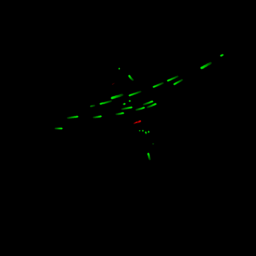
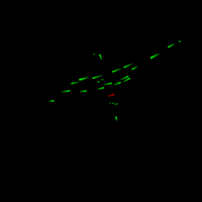
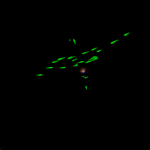

# Generative AI for Trajectory Prediction

This project is currently in progress.

This repository provides code for training a model that predicts vehicle trajectories. The model takes as input an image representing the previous one-second trajectory and generates an output image depicting the predicted trajectories for the next second in the traffic scenario.

Follow the steps below to set up and run the training process.

For more details, visit the [project page](https://giovannilucente.github.io/portfolio/diffusion_model_trajectory_predictor/index.html). 

This project is conducted in collaboration with other colleagues from DLR.

## Installation and Setup

To install and run this project locally, follow these steps:

### 1. Clone the repository
First, clone the repository to your local machine:
```bash
git clone https://github.com/giovannilucente/portfolio.git
cd portfolio/diffusion_model_trajectory_predictor
```

### 2. Install the requirements
Install all the required dependencies listed in the requirements.txt:
```bash
pip install -r requirements.txt
```

### 3. Download the DLR UT dataset
Navigate to the /trajectories folder and download the DLR UT trajectory dataset (in .csv format) from the [official site](https://zenodo.org/records/14773161):
```bash
cd trajectories
# Download here the trajectory dataset in .csv format
cd ..
```
Note: ensure that you download the dataset into the /trajectories folder.

### 4. Convert the dataset
Once the dataset is downloaded, use the provided Python script to convert the raw DLR UT dataset into images that can be used for training. Run the following command:
```bash
python3 rasterize_data.py
```
The images that will be used for training will be generated in the folder /output_images_cv2.

### 5. Launch the training
Now you can train the model using the following command:
```bash
python3 training.py
```
The model will train and the best-performing model will be saved in the folder:
```bash
/output/{name of the model}_{name of the loss function}.
```
Generated images of the validation dataset can be seen in the folder:
```bash
/output/validation_plots_{name of the model}_{name of the loss function}. 
```
## Example of Input, Ground Truth, and Predicted Images

Below is an example of the input image, ground truth image, and predicted image.

<p align="center">    </p>

